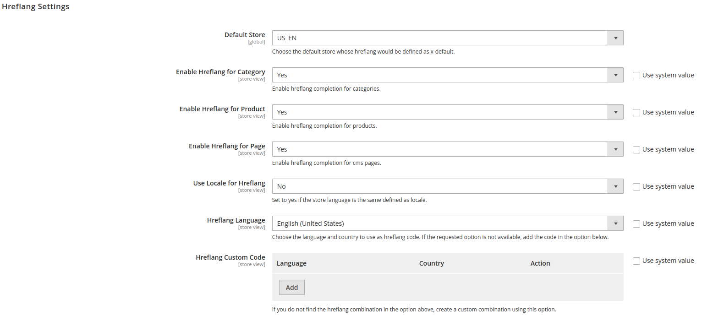
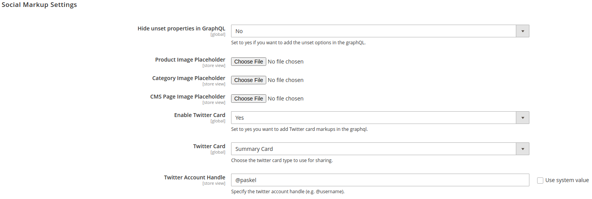
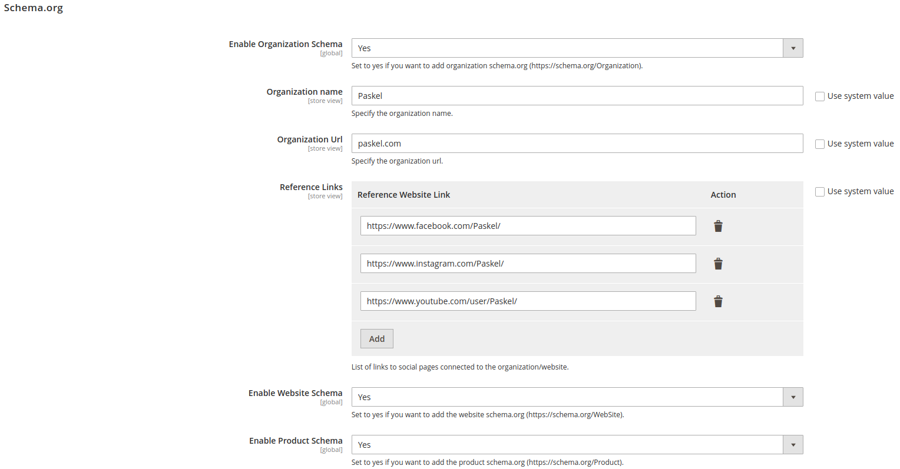

# magento2-pwa-seo

**Magento2 PWA SEO** is a module for Magento2 crafted to add advanced SEO features to your Magento2 website based on the new web technology standard called as **Progressive Web Application (PWA)**. Use it to add SEO-specific tags inside the Magento2 GraphQL schema and make your website *SEO friendly*, boosting its ranking in the search results of the most famous search engines.

If you like the module, leave a **star**! It's free for you, but keeps motivated me to help the community.

## Table of content

- [Installation](#installation)
- [SEO functionalities](#seo-functionalities)
- [Frontend PWA Settings](#frontend-pwa-settings)
- [Hreflang Tag](#hreflang-tag)
    - [Hreflang settings](#hreflang-settings)
    - [How to use hreflang](#how-to-use-hreflang)
- [Social Markup Tags](#social-markup-tags)
    - [Social Markup settings](#social-markup-settings)
    - [How to use social markup](#how-to-use-social-markup)
- [Schema.org](#schemaorg)
    - [Schema.org settings](#schemaorg-settings)
    - [How to use Schema.org](#how-to-use-schemaorg)
- [Troubleshooting](#troubleshooting)
- [Contribute](#contribute)

## Installation

To install the module inside your Magento2 project, go inside the root folder of Magento2 (called `$MAGENTO_FOLDER` from now on):

```shell
$ cd $MAGENTO_FOLDER
```

Create a new folder for the custom module:

```shell
$ mkdir -p app/code/Paskel
```

Move in the new folder and clone this repository:

```shell
$ cd app/code/Paskel
$ git clone git@github.com:Pasquale95/magento2-pwa-seo.git
$ mv magento2-pwa-seo Seo
```

Finalize the installation by upgrading Magento:

```shell
$ bin/magento setup:upgrade
```

## SEO functionalities

This module adds the following SEO functionalities to your Magento2:
- **hreflang** tags;
- **social markup** tags (also called social share tags).

## Frontend PWA Settings

Usually the frontend server is deployed on a separated machine. If this is your case, use this section to insert the url where your frontend server is reachable. 


If, on the contrary, your frontend server is reachable at the same url address of the backend server, set this option to **No**. In this way the hreflang links are generated using the store **base url** of your backend server.

## Hreflang tag

The `hreflang` tag is used to tell search engines which language is used in the page as the other languages in which the page is also available. This tag is useful to let the search engines prompting the page in the user language in the search result page.

### Hreflang settings

The module offers several settings to personalize the intended behaviour:



In details, you can:
- choose the default store for hreflang (*i.e.* the store tagged as `x-default`);
- enable/disable the hreflang tag for categories, products and pages;
- use the locale language for the hreflang or select another one.

### How to use hreflang

The module adds a new tag called `hreflang` inside the GraphQL schema of **categories**, **products** and **cms-pages**. If you have just installed the module, you must generate the hreflang tags by running the following command:

```shell
$ bin/magento hreflang:generate
```

To retrieve the hreflang tag, run the following query (the example is on a cms-page, but it works the same for categories and products):

```graphql
query {
    cmsPage(id:5) {
        identifier
        hreflang {
            code
            href
        }
    }
}
```

The response payload has the following layout:

```json
{
    "data": {
        "cmsPage": {
            "identifier": "mypage",
            "hreflang": [
                {
                    "code": "x-default",
                    "href": "https://www.paskel.com/us/en/mypage"
                },
                {
                    "code": "it-it",
                    "href": "https://www.paskel.com/it/it/mypage"
                },
                {
                    "code": "es-us",
                    "href": "https://www.seo.com/us/es/mypage"
                }
          ]
        }
    }
}
```

Use these pieces of information to build at frontend the html hreflang tags and add them in the `<head>` tag:

```html
<head>
    ...
    <link rel=”alternate” href=”https://www.paskel.com/us/en/mypage” hreflang=”x-default”/>
    <link rel=”alternate” href=”https://www.paskel.com/it/it/mypage” hreflang=”it-it”/>
    <link rel=”alternate” href=”https://www.paskel.com/us/es/mypage” hreflang=”es-us”/>
</head>
```

## Social Markup tags

### Social Markup settings

The module offers several settings to personalize the intended behaviour:



In details, you can:
- set the *site name* used to populate the `og:site_name` tag;
- set image placeholders for categories, products and pages to use in case no image has been set for a specific item.

### How to use social markup

The module adds a new tag called `socialMarkup` inside the GraphQL schema of **categories**, **products** and **cms-pages**. It supports the OpenGraph protocol, adding new **meta-tags** useful to make categories, products and pages shareable on social networks.

To retrieve the social markup tags, run the following query (the example is on a cms-page, but it works the same for categories and products):

```graphql
query {
    cmsPage(id:5) {
        identifier
        socialMarkup {
            property
            content
        }
    }
}
```

The response payload has the following layout:

```json
{
    "data": {
        "cmsPage": {
            "identifier": "mypage",
            "socialMarkup": [
                {
                    "property": "og:type",
                    "content": "website"
                },
                {
                    "property": "og:locale",
                    "content": "en_US"
                },
                {
                    "property": "og:site_name",
                    "content": "Paskel SEO Pwa"
                },
                {
                    "property": "og:url",
                    "content": "https://www.paskel.com/us/en/mypage"
                },
                {
                    "property": "og:title",
                    "content": "My Page"
                },
                {
                    "property": "og:description",
                    "content": "My Page meta description"
                },
                {
                    "property": "og:image",
                    "content": "http://local.magento.it/pub/media/seo/tmp/cmspage/social.jpeg"
                }
            ]
        }
    }
}
```

Use these pieces of information to build at frontend the html social share tags and add them in the `<head>` tag:

```html
<head>
    ...
    <meta property="og:type" content="website">
    <meta property="og:locale" content="en_US">
    <meta property="og:site_name" content="Paskel SEO Pwa">
    <meta property="og:url" content="https://www.paskel.com/us/en/mypage">
    <meta property="og:title" content="My Page">
    <meta property="og:description" content="My Page meta description">
    <meta property="og:image" content="http://local.magento.it/pub/media/seo/tmp/cmspage/social.jpeg">
</head>
```

## Schema.org

### Schema.org settings

The module adds three possible schemas to enable/disable:
- **Organization Schema**, used to add organization-related information on all pages (more details [here](https://schema.org/Organization));
- **Website Schema**, used to add website-related information on all pages (more details [here](https://schema.org/WebSite));
- **Product Schema**, used to add product-related information in product page (more details [here](https://schema.org/Product));



### How to use schema.org

The module adds a new tag called `schemaOrg` inside the GraphQL schema of **categories**, **products** and **cms-pages**. Such tag returns an array of schema scripts in `JSON-LD` format (see the example below):

```graphql
query {
    cmsPage(id:5) {
        identifier
        schemaOrg {
            schemaType
            script
        }
    }
}
```

The response payload has the following layout:

```json
{
  "data": {
    "cmsPage": {
      "identifier": "mypage",
      "schemaOrg": [
        {
          "schemaType": "Organization",
          "script": "<script type=\"application/ld+json\">{\"@context\": \"https://schema.org\",\"@type\": \"Organization\",\"name\": \"Paskel\",\"url\": \"paskel.com\",\"logo\": \"http://local.magento.it/it/pub/media/seo/general/logo/default/paskel-icon.png\",\"sameAs\": [\"https://www.facebook.com/Paskel/\",\"https://www.instagram.com/Paskel/\",\"https://www.youtube.com/user/Paskel/\"]}</script>"
        },
        {
          "schemaType": "WebSite",
          "script": "<script type=\"application/ld+json\">{\"@context\": \"https://schema.org\",\"@type\": \"WebSite\",\"name\": \"Paskel SEO\",\"url\": \"https://www.paskel.com/\"}</script>"
        }
      ]
    }
  }
}
```

Eventually, the `script` content must be injected in the page.

**N.B.**: the `schemaOrg` tag returns a third schema script once called in the products graphql, which is the Product schema.org.

## Troubleshooting

**The hreflang tag is null. How to populate it?**

Make sure you run `bin/magento hreflang:generate` in order to generate the hreflang tags. 

In addition, in *Stores -> Configuration -> Paskel -> Seo -> Hreflang Settings*, check that you have enabled the hreflang completion for the class of item (category, product, page) where the tag is null (see [Hreflang Tag](#hreflang-tag)).

**I changed my PWA Frontend Url, but the hreflang tag points to the old url. How to update it?**

Run the command `bin/magento hreflang:generate` to update the hreflang tags.

## Contribute

To contribute please fork the project and then make a pull request.